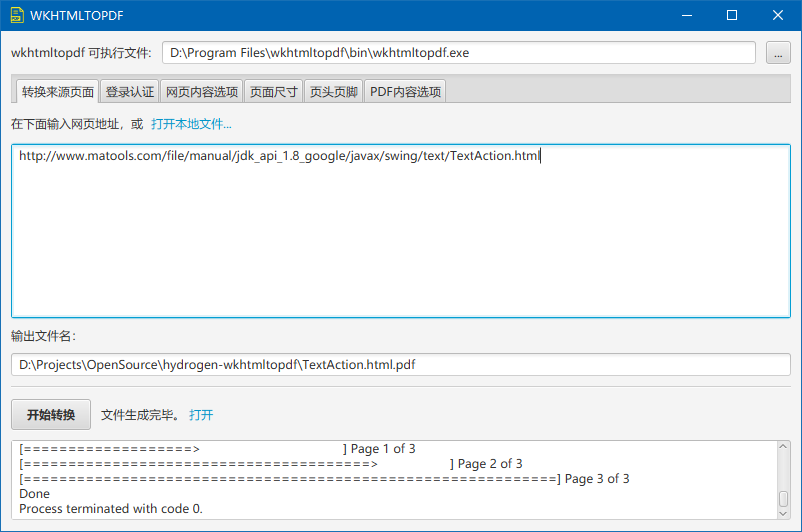
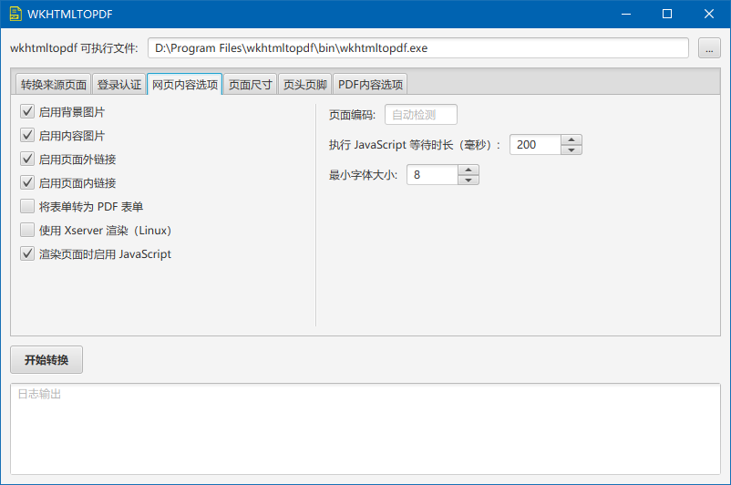

# hydrogen-wkhtmltopdf

GUI wrapper for [wkhtmltopdf](https://wkhtmltopdf.org)

### Note for compiling:

This project refers to my another open source javafx library [hydrogen-fx](https://github.com/yiding-he/hydrogen-fx),
so if you want to build this please clone hydrogen-fx first and run `mvn install`.

### Note for packaging:

Package with `mvn package` will get 2 packaged files: `hydrogen-wkhtmltopdf.jar` 
and `hydrogen-wkhtmltopdf-jar-with-dependencies.jar`.
The latter one is a fat jar that contains all dependencies, 
so it can be run using `java -jar hydrogen-wkhtmltopdf-jar-with-dependencies.jar`.

### Switch Language:

When running with `java -jar` command, you can switch language by adding 
`-Duser.language=en` or `-Duser.language=zh_CN` to the command. Currently, 
only English and Chinese are supported.

### Screenshots:

